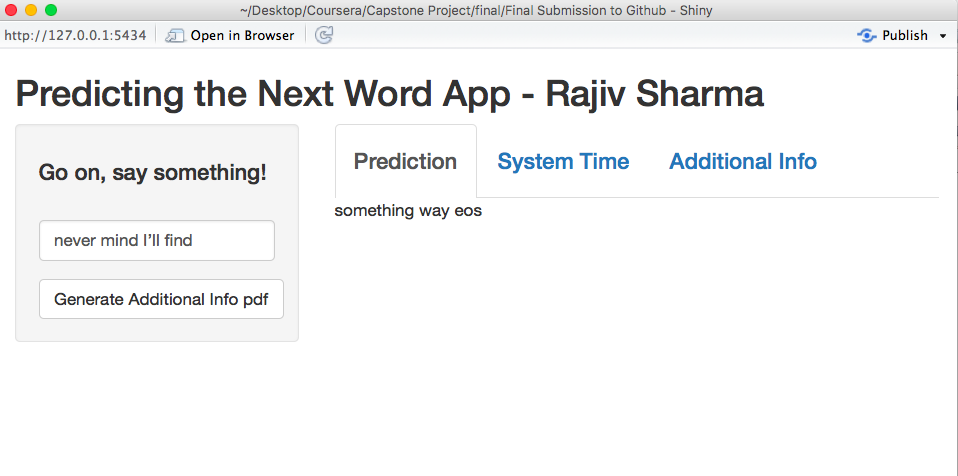
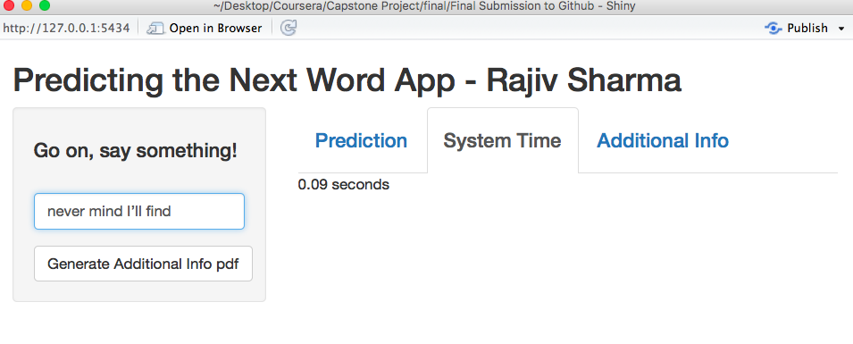

Capstone Project - Next Word Prediction App
========================================================
author: Rajiv Sharma
date: September 10, 2017
autosize: true

A Next Word Prediction App
========================================================

- Use NLP, Markov Chains and Kneser-Ney and Katz Backoff Algorithms to predict next words to a chunk of words or sentences

- Project is conceived in line with the Swiftkey Word Prediction App found on iOS and Android phones

- App takes millions of sentences from twitter, blogs and news articles obtained from the HC Corpora dataset

How Do We Predict The Next Word?
========================================================

The dataset is cleaned (and preprocessed) by:

- Removing punctuation
- Converting to lowercase
- Cleaning gibberish and typos
- Removing profanity words
- Removing stopwords (common words like you, are, is etc, removal of which         improves accuracy)
- Convert to n-grams or tokens with one, two or three word tokens
- “never mind I'll find$$” becomes “never mind I will find” which then         becomes “bos never mind find eos” by removing stopwords and adding         beginning and end of line markers.

Prediction Using N-Grams 
========================================================

- Sample with millions of sentences, converted to uni-, bi- and tri-grams are processed using Quanteda and TM packages

- Data tables that make accessing the tokens by their most frequent - occurrences are searched in the App to yield the most likely next words

- Sample words that are missing in the data tables are estimated using nifty Kneser-Ney Algorithms and Katz/Stupid Backoff Methods

- “bos never mind find eos” gets tokenized as “bos never mind ”, “never mind find” and “mind find eos” tokens

Next Words
========================================================

- From the “bos never mind ”, “never mind find” and “mind find eos” tokens we pick the last token and predict a replacement for “eos”

- The three replacements we find are: "something" "way” and "eos”. (“eos” implies this sentence should end here.)

- If the sample datasets lack the sample words then we “stupid backoff” to the lower grams from trigrams to bigrams and pick the most occurring token

- Failing the lower gram, we go to the unigram to find if the sample word occurs there…

App Snapshot With Prediction
========================================================

- Never mind I'll find...something, way, eos (end of sentence or '.')

App Snapshot With Efficiency
========================================================

-The algos give us a decent accuracy but also process the predictions under a second.

